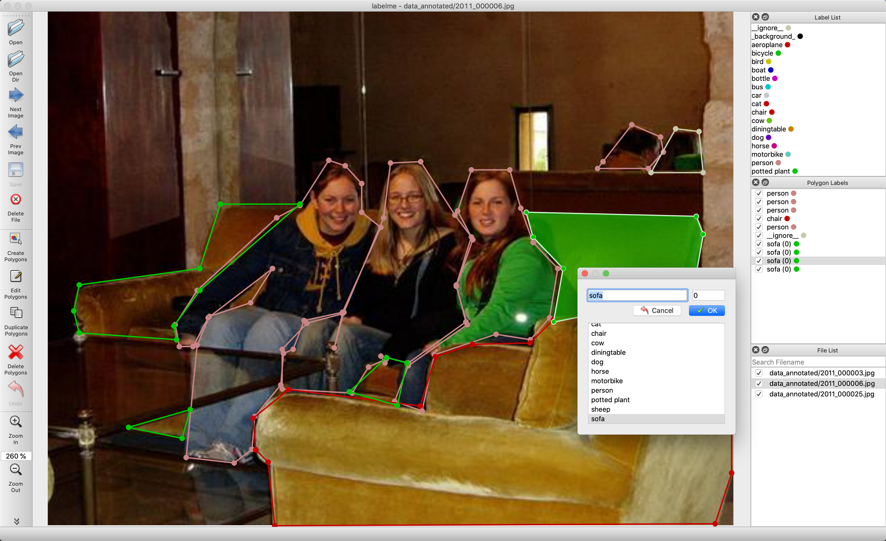
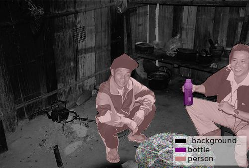
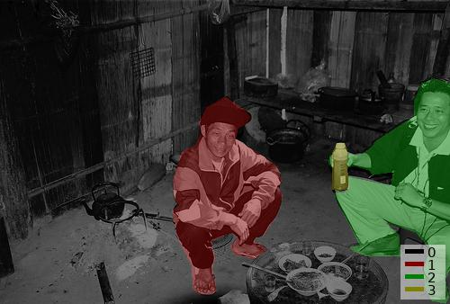
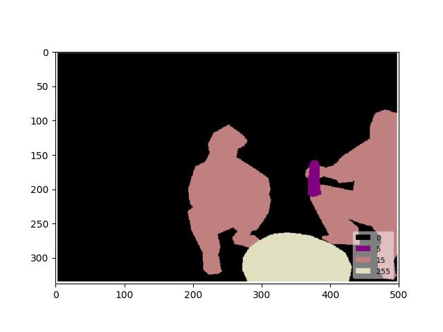
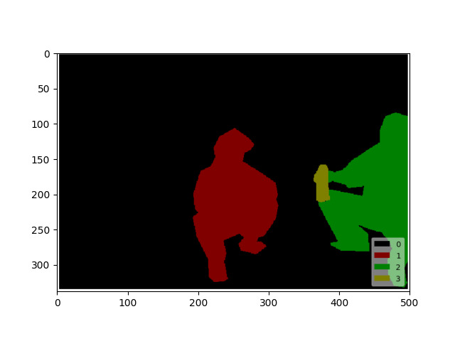

# Instance Segmentation Example

## Annotation

```bash
labelme data_annotated --labels labels.txt --nodata --validatelabel exact --config '{shift_auto_shape_color: -2}'
labelme data_annotated --labels labels.txt --nodata --labelflags '{.*: [occluded, truncated], person-\d+: [male]}'
```



## Convert to VOC-format Dataset

```bash
# It generates:
#   - data_dataset_voc/JPEGImages
#   - data_dataset_voc/SegmentationClass
#   - data_dataset_voc/SegmentationClassVisualization
#   - data_dataset_voc/SegmentationObject
#   - data_dataset_voc/SegmentationObjectVisualization
./labelme2voc.py data_annotated data_dataset_voc --labels labels.txt
```

    
Fig 1. JPEG image (left), JPEG class label visualization (center), JPEG instance label visualization (right)


Note that the label file contains only very low label values (ex. `0, 4, 14`), and
`255` indicates the `__ignore__` label value (`-1` in the npy file).  
You can see the label PNG file by following.

```bash
labelme_draw_label_png data_dataset_voc/SegmentationClassPNG/2011_000003.png   # left
labelme_draw_label_png data_dataset_voc/SegmentationObjectPNG/2011_000003.png  # right
```

 


## Convert to COCO-format Dataset

```bash
# It generates:
#   - data_dataset_coco/JPEGImages
#   - data_dataset_coco/annotations.json
./labelme2coco.py data_annotated data_dataset_coco --labels labels.txt
python labelme2coco.py /home/luolu/Desktop/instance_ning71x-16-0672 /home/luolu/Desktop/dataset_ning71x-16-0672 --labels labels.txt
python labelme2coco.py /home/luolu/Desktop/instance_dataset/train /home/luolu/Desktop/instance_coco --labels labels.txt --validatelabel exact --config '{shift_auto_shape_color: -2}'

python labelme2coco.py /home/luolu/Desktop/pore660/train2017 /home/luolu/Desktop/pore660/instance_dataset_pore --labels labels_pore.txt
```
